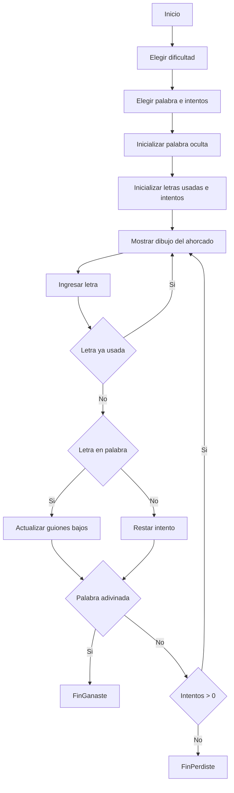

# Proyecto Final - Juego del Ahorcado (PDC)

Este proyecto consiste en una versión interactiva del clásico **juego del ahorcado**, desarrollada en Python como entrega final del curso de Programación de Computadores (PDC). El objetivo es adivinar una palabra secreta letra por letra antes de quedarse sin intentos.

## Objetivo del juego

El jugador debe evitar cometer demasiados errores mientras intenta descubrir la palabra oculta. Cada error hace avanzar el dibujo del ahorcado hasta completar todos los intentos disponibles.

---

## Estructura del proyecto

ProyectoPDC(1).py ← Código principal del juego

PalabrasFacil.txt ← Lista de palabras fáciles (4-5 letras)

PalabrasMedio.txt ← Lista de palabras medias (6-7 letras)

PalabrasDificil.txt ← Lista de palabras difíciles (8+ letras)

---

## Tecnologías usadas

- Python 
- Entrada/Salida por consola
- Lectura de archivos `.txt`
- Listas, condicionales, ciclos, funciones

---

## Funcionalidades principales

- Selección de dificultad:
  - **Fácil**: palabras de 4 a 5 letras
  - **Media**: palabras de 6 a 7 letras
  - **Difícil**: palabras de 8 letras o más (con solo 5 intentos)

- Juego en consola, completamente interactivo
- Dibujo dinámico del ahorcado (ASCII) que cambia según los errores
- Validación de letras repetidas y control de errores

---

## Cómo jugar

1. Ejecuta el archivo `ProyectoPDC(1).py`.
2. Escoge una dificultad (1, 2 o 3).
3. Ingresa letras una por una e intenta adivinar la palabra antes de que se acaben los intentos.
4. Ganas si descubres la palabra completa. Pierdes si se agotan los intentos.

---

## Diagrama de flujo del juego

